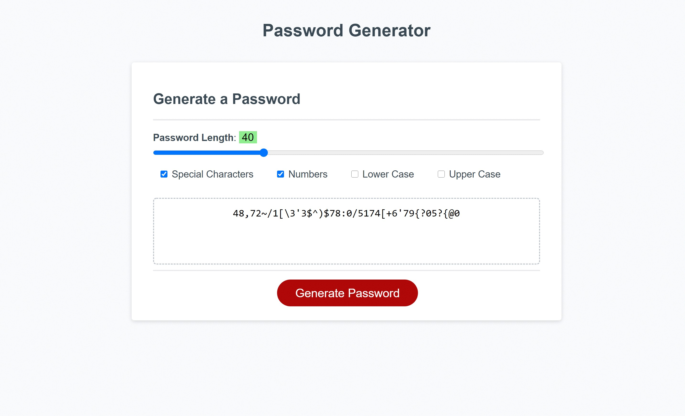

# Password Generator

## User Story 

AS AN employee with access to sensitive data
I WANT to randomly generate a password that meets certain criteria
SO THAT I can create a strong password that provides greater security

## Description

This mobile-responsive application generates a random password after taking into account the following user inputs: 
* Password length
* Type of characters wanted in password (special, numeric, lower cased and/or upper cased)

## Tools & Technologies 

* Fundamental Javascript 

## Visuals 

## Project Status

Completed!
